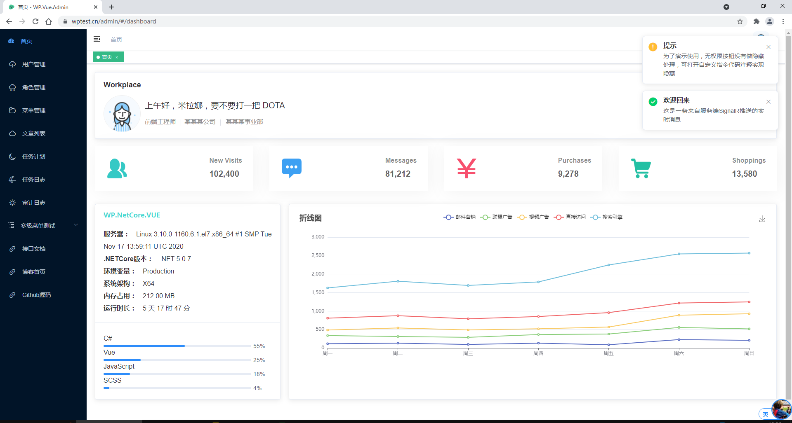
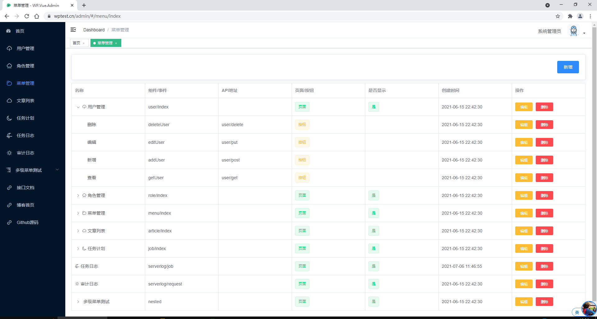
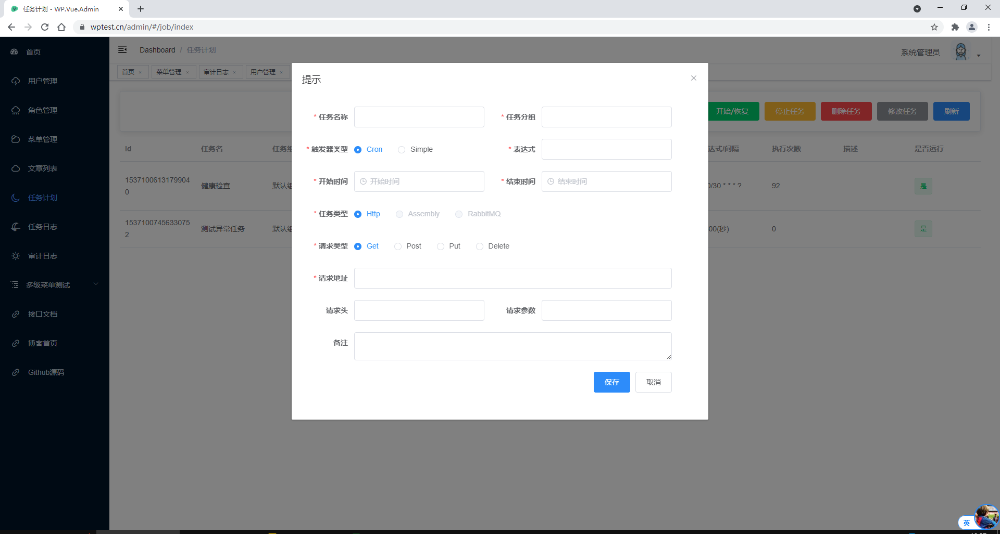
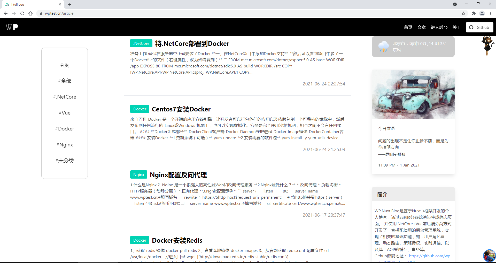

# WP.NetCore.VUE

#### WP.NetCore.VUE是采用前后端分离方式开发的一套开源的后台管理系统

------------

#### 后端： .NetCore+EFCore
#### 前端：基于vue-element-admin的二次发开
#### 网站：Nuxt.js

包括了常用功能：用户角色管理、策略授权、动态路由、数据库读写分离、链路追踪、Quartz任务调度、RBMQ事件总线、SignalR实时通讯、Docker容器化部署、日志

### 预览地址：[https://www.wptest.cn](https://www.wptest.cn)

#### 用户名：test &nbsp;&nbsp;&nbsp;&nbsp;密码：test

可通过菜单进入管理后台

------------

| 名称  |  说明 |
| :------------ | :------------ |
|  EFCore  | 微软ORM  |
|  AutoFac  | 依赖注入  |
|  AutoFac.DynamicProxy  | 动态代理  |
|  maxscale  |  数据库中间件 |
|  skywalking  |  链路追踪 |
|  Quartz.net  |  任务调度 |
|  Cap  | 事件总线  |
|  RabbitMQ  | 消息队列  |
|  Polly  | 重试、熔断、超时  |
|  CORS   | 跨源资源共享  |
|  JWT   | 身份认证  |
|  Serilog  | 结构化日志  |
|  SignalR   | 实时通讯  |
|  IpRateLimiting   |  接口限流 |
|  StackExchange.Redis  | Redis缓存  |
|  Swagger  | 接口文档  |
|  Automapper  |  对象映射 |

